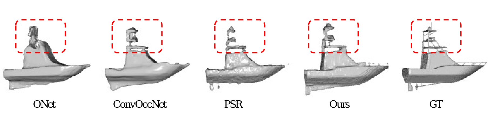

# README

## Introduction

This repo is the implementation of [Tensorformer](https://arxiv.org/pdf/2306.15989.pdf) in Pytorch.


## Demo

- Here is an example result of our repo.


## Installation
First you have to make sure that you have all dependencies in place. The simplest way to do so, is to use anaconda.

You can create an anaconda environment called mesh_funcspace using
```
conda env create -f environment.yaml
conda activate tensorformer
```


## Data preparation
- We follow the [ONet](https://github.com/autonomousvision/occupancy_networks) to generate all the data, including ShapeNet and ABC, where ABC is the guest dataset of [ONet](https://github.com/autonomousvision/occupancy_networks).
- After generating the dataset, we can put the data in `dataset`.

## Training
###ShapeNet
```python main.py --ae --train --phase 1 --iteration 300000 --dataset data/data_per_category/data_per_category/00000000_all/00000000_vox256_img --sample_dir data/output/vessel_64 --sample_vox_size 64```
### ABC
```python main.py --ae --train --phase 1 --iteration 300000 --dataset data/data_per_category/data_per_category/001_ling/001_vox256_img --sample_dir data/output/ling_64 --sample_vox_size 64```

## Generate Mesh
###ShapeNet
```python main.py --ae --phase 1 --sample_dir samples/bsp_ae_out --dataset data/data_per_category/data_per_category/00000000_all/00000000_vox256_img --start 0 --end 20```
###ABC
```python main.py --ae --phase 1 --dataset data/data_per_category/data_per_category/001_ling/001_vox256_img --sample_dir data/output/ling_64 --start 0 --end 100```

## Evaluation
```python evaluate.py```
